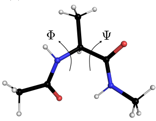
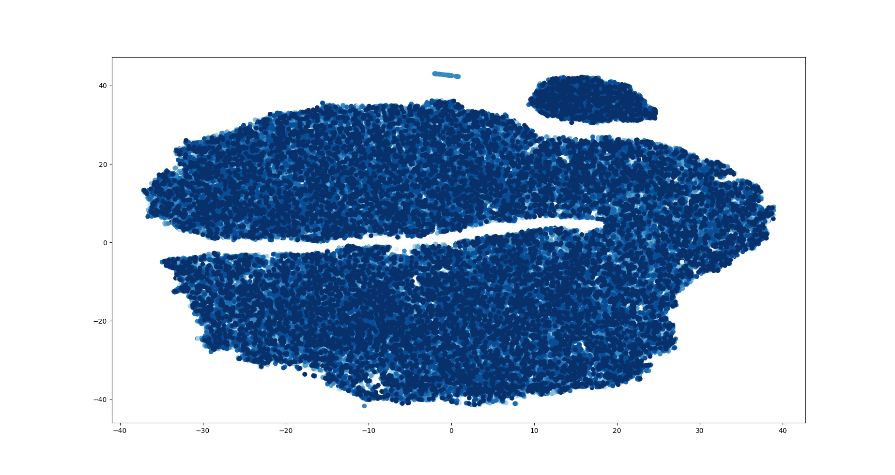
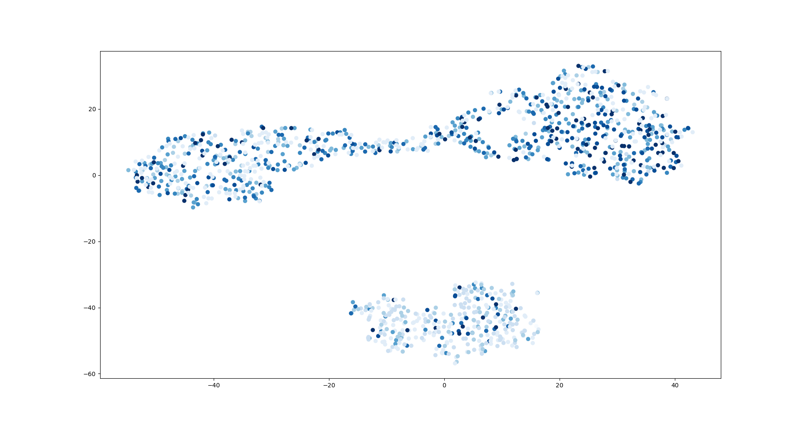
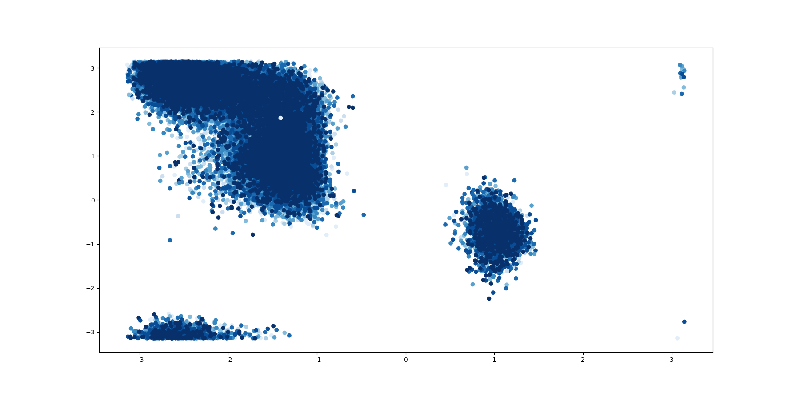

## The program was a final task of the course 'Programming in Python' for 4 year physics students at University Nicolaus Copernicus.

## `numpy`, `sklearn`, `matplotlib`

1. Read the data set (`dialanine-300K.data`). The data set contains a simulation of alanine dipeptide at 300 K. We will focus mainly on columns d1-d45 which describe heavy atom distances of the dynamical system in nanometers.

2. Calculate the variance of each distance and remove these distances that have variance below 2e-4 nm^2.

3. Create a tSNE object and train it using the remaining distances. We want to get a low-dimensional map in 2D.

4. Plot the 2D map using `plt.scatter` and color each point by time (1st column).

5. Compare the 2D map to a scatter plot in Phi-Psi space (`phi`, `psi` columns in the data set).

6. Write your conclusions. We know that the system can be characterized by the Psi and Phi torsional angles. Does the 2D mapping generated by tSNE contain all the characteristics of the system?

## 
## Results

### I. Plot made from training with 100k distances

### II. Plot made from training with 1,2k distances

### III. Plot from `phi`, `psi` columns

